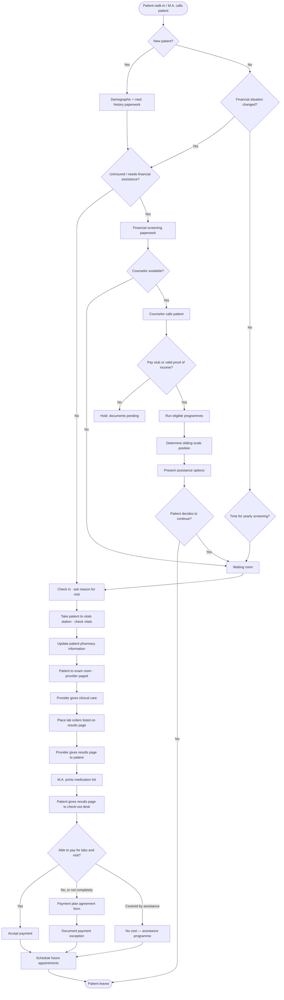

<div align="center">
  
  <h1>SAMIHA POLYCLINIC &amp; DIAGNOSTICS — ERP</h1>
  <p><b>Care • Compassion • Commitment</b></p>
  <p>One system from the first enquiry to the patient walking out.</p>
</div>

---

A complete clinic ERP built around the attached **visit workflow chart** — walk-in through
check-in, financial screening, vitals, examination, diagnostics, pharmacy and check-out —
extended with in-patient records and WhatsApp appointment booking.

## Quick start

```bash
npm install
cp .env.example .env          # optional — sensible defaults work as-is
npm run setup                 # create the database and load starter data
npm start                     # → http://localhost:3000
```

Sign in with any staff email below and the password **`samiha@123`**.

| Desk | Email | What they can do |
|---|---|---|
| Administrator | `admin@samiha.local` | Everything, plus staff, schedules and the audit log |
| Front desk | `reception@samiha.local` | Enquiries, registration, appointments, arrival, check-in |
| Financial counselor | `counselor@samiha.local` | Screening, sliding scale, assistance programmes |
| Nurse / M.A. | `nurse@samiha.local` | Vitals station, pharmacy details, ward vitals |
| Doctor | `imran@samiha.local` | Consultation, prescriptions, lab orders, discharge |
| Lab technician | `lab@samiha.local` | Sample collection, results, verification |
| Pharmacist | `pharmacy@samiha.local` | Dispensing, stock, formulary |
| Cashier | `cashier@samiha.local` | Billing, payments, plans, exceptions |
| Ward sister | `ward@samiha.local` | Beds, admission, rounds, medication chart |

Other doctors: `sara@samiha.local` (Pediatrics), `nafisa@samiha.local` (Gynecology),
`arif@samiha.local` (Cardiology), `neha@samiha.local` (Dentist),
`priya@samiha.local` (Dermatology), `vikram@samiha.local` (Orthopedics).

### Services configured

Matching the clinic's own service board — these drive the booking flow, the department
filters and the reports:

| Specialist categories | Diagnostic categories |
|---|---|
| Internal Medicine · Pediatrics · Gynecology · Cardiology · Dentist · Dermatology · Orthopedics | Diagnostics / Lab · Pharmacy · Day Care / Ward · X-Ray · USG (Ultrasound) |

Only **specialist** departments take consultations and appear in the WhatsApp booking menu;
diagnostic departments are service counters. Add or change them in **Departments**
(`POST /api/masters/departments`) or in `src/db/seed.js`.

> **Change every seeded password before going anywhere near real patient data**, and set a
> real `SESSION_SECRET` in `.env`.

```bash
npm test          # end-to-end test of the whole workflow
npm run db:reset  # wipe and start over
npm run dev       # auto-restart on file changes
```

## The workflow, as implemented

The four lanes below are the four lanes of the source chart. **Workflow Map** inside the app
shows the same thing, with a link from every step to the screen that handles it.



### What each lane does here

**Check in** — Arrival creates the visit and answers the chart's first three decisions
automatically: first-ever visit sets the *new patient* flag and demands the demographic and
medical-history paperwork; an uninsured patient or a changed financial situation routes into
the screening lane; a last screening date over a year old raises *yearly screening due* for
the doctor. Check-in refuses to proceed without a reason for visit.

**Financial screening** — Opening a case checks whether a counselor is free; if not the case
queues and the patient waits, exactly as charted. The counselor enters household size and
annual income, which is divided by the poverty guideline for that household size to give an
**FPL percentage**, which maps to a **sliding-scale band (A–F)** and a discount, and lists the
**assistance programmes** the patient qualifies for. **Without proof of income no band is
assigned** — the case is held at *documents pending*. The patient's decision to continue,
defer or decline is recorded; declining sends them to the exit.

**Examination** — Vitals compute BMI live and raise clinical alerts (hypertensive range, low
SpO₂, fever, tachycardia) before the patient sits back down. The consultation is a SOAP note
with ICD-10 diagnoses, a prescription built against the live formulary (with an allergy
cross-check and stock visibility), and lab orders. Signing the note routes the patient to
diagnostics, pharmacy or the check-out desk depending on what is outstanding. The **results
page** is the printable sheet the patient carries forward.

**Check out** — Assembling the bill pulls the consultation fee, every diagnostic ordered and
any pharmacy charge onto one invoice, then applies the sliding-scale discount and assistance
coverage from the completed screening. All four branches of the chart are supported and
**enforced**: a visit cannot be closed with money outstanding unless a payment plan or a
documented exception exists. Check-out books the follow-up and issues an exit pass.

## Beyond the chart

| Module | What it adds |
|---|---|
| **WhatsApp** | Patients book, confirm, cancel, check report status and request refills in chat. See [`docs/WHATSAPP.md`](docs/WHATSAPP.md). |
| **Enquiries** | Every first contact — walk-in, phone, WhatsApp, web, camp — tracked to conversion or closure. |
| **Appointments** | Doctor sessions and leave, live slot availability, token numbers, no-show handling. |
| **Diagnostics** | Order → sample barcode → processing → result entry with automatic abnormal flagging → verification → report released to the patient. |
| **Pharmacy** | Batch and expiry tracking, first-expiry-first-out allocation, allergy safety check, stock ledger, low-stock and expiry alerts, and over-the-counter sales to walk-ins who are not our patients. |
| **Barcodes & stock register** | A barcode on every medicine and every batch — scanned at the counter, printed from the ERP — plus suppliers, goods-received notes, a reconciling stock register and physical stock takes. See [`docs/PHARMACY-STOCK.md`](docs/PHARMACY-STOCK.md). |
| **In-patient** | Bed board, admission, transfers, doctor rounds and nursing notes, medication administration record, accrued charges, discharge summary and settlement. |
| **Billing** | Invoices, receipts, instalment agreements, documented exceptions, assistance cover, day book. |
| **Insurance & TPA** | Empanelled insurers and TPAs, patient policies with sum-insured, co-pay and room-rent caps, cashless pre-authorisation with queries and enhancements, claims from the bill through to settlement, and receivables ageing. See [`docs/INSURANCE.md`](docs/INSURANCE.md). |
| **Reports** | Footfall and revenue trends, doctor productivity, **stage-by-stage turnaround**, audit log. |
| **Account & system** | Password reset by email with single-use links, show/hide on every password field, nightly database backups with off-site notices, and mail health checks. See [`docs/DEPLOYMENT.md`](docs/DEPLOYMENT.md). |

## Guardrails

These are enforced in the API, not just the interface:

- A visit cannot be checked out with an outstanding balance unless a **payment plan** or a
  **documented exception** exists.
- A sliding-scale band cannot be assigned without **proof of income** on file.
- The pharmacy refuses to dispense beyond stock on hand, and warns on recorded allergies.
- A diagnostic report cannot be released until every test in the order has a result.
- A bed cannot be double-booked; a patient cannot be admitted twice; two appointments cannot
  take the same slot with the same doctor.
- A pre-authorisation cannot be approved beyond the sum insured left on the policy, and a
  settlement cannot exceed what was approved.
- An insurer's approval sits on the bill as cover, so a cashless patient owes only their own
  share — and any settlement **shortfall returns to their balance** rather than being
  silently written off.
- Discharge posts bed-day charges automatically and blocks on an unsettled bill.
- Every state change is written to an immutable **visit trail** and the **audit log**.
- Password reset answers identically for real and unknown accounts, is rate-limited, stores
  only a token hash, works once, and signs out every session on that account.

## Architecture

```
src/
├── server.js            Express app, routing, error handling, background jobs
├── config.js            Environment configuration with a built-in .env loader
├── db/
│   ├── schema.sql       The full data model (~40 tables)
│   └── seed.js          Departments, staff, formulary, tests, wards, sliding scale
├── lib/                 auth (scrypt + sessions), ids, validation, audit, http errors
├── services/            slidingScale · billing · pharmacy · scheduling · insurance
│                        whatsapp (transport) · whatsappBot (conversation) · notifications
└── routes/              auth · masters · patients · enquiries · appointments · visits
                         financial · lab · pharmacy · billing · ipd · insurance
                         whatsapp · reports
public/                  Zero-build front end: vanilla JS SPA, hash routing, printable documents
tests/                   End-to-end walks of the whole workflow and the insurance lifecycle
```

**Stack:** Node.js 20+, Express and SQLite (via `better-sqlite3`) — two runtime dependencies,
no build step, no external services required. It runs on a single machine in the clinic and
the whole database is one file you can copy for backup.

**Security:** scrypt password hashing, server-side sessions in HTTP-only cookies, role-based
authorisation on every route, parameterised SQL throughout, and HTML-escaped rendering
everywhere in the front end.

## Configuration

Everything lives in `.env` — see [`.env.example`](.env.example). The essentials:

| Variable | Purpose |
|---|---|
| `SESSION_SECRET` | **Set this.** Generate with `node -e "console.log(require('crypto').randomBytes(32).toString('hex'))"` |
| `DB_FILE` | Database path (default `./data/samiha.db`) — put it on a persistent disk |
| `APP_URL` | Public URL; password-reset links are built from it |
| `RECOVERY_EMAIL` | Clinic mailbox that receives every reset link and backup notice (`samihahospital@gmail.com`) |
| `MAIL_PROVIDER` | `mock` (offline, the default) or `smtp` (Gmail App Password) |
| `BACKUP_DIR`, `BACKUP_HOUR`, `BACKUP_RETENTION` | Nightly snapshots and how many to keep |
| `CLINIC_*` | Name, address, phone, GSTIN — printed on every invoice and report |
| `WHATSAPP_PROVIDER` | `mock` (offline simulator, the default) or `meta` (live) |

Deploying, account recovery and backups are covered in
[`docs/DEPLOYMENT.md`](docs/DEPLOYMENT.md).

## Before going live

1. Change every seeded password, set a real `SESSION_SECRET`, then set `AUTO_SEED=false`.
2. Put the app behind HTTPS (a reverse proxy is fine) and set `NODE_ENV=production`.
   **Put `DB_FILE` and `BACKUP_DIR` on a persistent disk** — on Railway, Render or Fly the
   filesystem is wiped on every deploy without a volume.
3. Replace the seeded formulary, service prices, lab tariffs and ward tariffs with your own.
4. Set the poverty guideline and sliding-scale bands to your clinic's actual policy —
   the seeded figures are illustrative.
5. Replace the seeded insurer turnaround times, settlement periods and tariff discounts with
   the terms in your own empanelment agreements.
6. Schedule a backup of the database file, and test restoring it.
7. Check local requirements for medical-record retention, prescription rules for Schedule H
   medicines, and invoice/GST formats.
